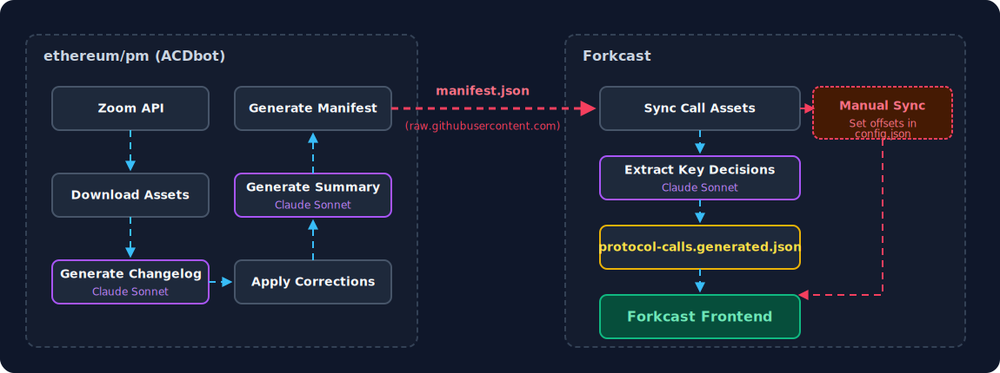

# ACDbot-to-Forkcast Asset Pipeline

The asset pipeline transforms Zoom meeting recordings into browsable call pages on [Forkcast](https://github.com/ethereum/forkcast). It spans two repositories — [ethereum/pm](https://github.com/ethereum/pm) and Forkcast — connected by a shared manifest. ACDbot produces assets on the PM side; Forkcast consumes them.

## Architecture



## How It Works (PM Side)

The pipeline lives in `pm/.github/ACDbot/scripts/asset_pipeline/` and is orchestrated by `run_pipeline.py`. It runs via the `meeting-asset-pipeline.yml` workflow every 2 hours, or on manual dispatch for a specific series/call.

### Pipeline steps

| Step | Script | What it does |
|------|--------|-------------|
| 1 | `download_zoom_assets.py` | Fetches transcript (`.vtt`), chat (`.txt`), and optionally Zoom's AI summary (`.json`) from the Zoom API. Selects the longest recording (>10 min) if multiple exist for one date. |
| 2 | `generate_changelog.py` | Sends the transcript + `ethereum_vocab.yaml` to Claude Sonnet (default; configurable via `--model`). Returns a TSV of corrections with confidence levels (high/medium/low). |
| 3 | *(human review)* | In manual mode, the operator reviews the changelog. In CI mode (`--auto-approve`), this step is skipped. |
| 4 | `apply_changelog.py` | Applies TSV corrections to produce `transcript_corrected.vtt` via global string replacement. |
| 5 | `generate_summary.py` | Sends the transcript, chat, and GitHub issue agenda to Claude Sonnet. Produces `tldr.json` — a structured summary with highlights, action items, decisions, and targets. |
| 6 | `generate_manifest.py` | Scans all artifact directories and writes `manifest.json` — the contract that Forkcast reads. |

### Artifact directory structure

Each call produces a directory at `pm/.github/ACDbot/artifacts/{series}/{date}_{number}/`:

```
artifacts/acdc/2026-02-19_175/
  transcript.vtt              # Original Zoom transcript
  transcript_corrected.vtt    # Cleaned transcript (after changelog applied)
  transcript_changelog.tsv    # Correction log (TSV: original, corrected, confidence)
  chat.txt                    # Zoom chat log
  tldr.json                   # Structured meeting summary
```

### Manifest structure

`manifest.json` is the upstream index that Forkcast reads to discover new calls. Top-level structure:

```json
{
  "version": 1,
  "series": {
    "acdc": {
      "name": "All Core Devs - Consensus",
      "youtubePlaylist": "PLJqWcTqh_zKFtf6yUxjwjE5P1gsDSIPjV",
      "calls": [
        {
          "date": "2026-02-19",
          "path": "acdc/2026-02-19_175",
          "number": 175,
          "issue": 1930,
          "videoUrl": "https://youtube.com/watch?v=o4fNYC3FTE4",
          "resources": {
            "transcript": "transcript.vtt",
            "transcript_corrected": "transcript_corrected.vtt",
            "changelog": "transcript_changelog.tsv",
            "chat": "chat.txt",
            "tldr": "tldr.json"
          }
        }
      ]
    }
  }
}
```

## How It Works (Forkcast Side)

Two scripts run sequentially via `sync-call-assets.yml` (hourly cron). Both live in `forkcast/scripts/`.

### Step 1: Sync call assets (`sync-call-assets.mjs`)

1. **Fetches** `manifest.json` from `https://raw.githubusercontent.com/ethereum/pm/master/.github/ACDbot/artifacts/manifest.json`.
2. **Maps** PM series names to Forkcast short codes (i.e. `glamsterdamrepricings` → `price`, `rpcstandards` → `rpc`). Core series like `acdc`, `acde`, `acdt` pass through unchanged. The full mapping is defined in `SERIES_TO_TYPE` in `sync-call-assets.mjs` — series not in `KNOWN_TYPES` are skipped with a console warning.
3. **Filters** — only syncs calls that have a `videoUrl` AND at least one of `tldr`, `transcript`, or `transcript_corrected`.
4. **Downloads** new assets to `forkcast/public/artifacts/{type}/{date}_{number}/`. Skips files that already exist locally unless `--force` is passed.
5. **Generates `config.json`** for each call — stores the issue number, video URL, and sync offsets. For livestreamed types (`acdc`, `acde`, `acdt`), sync times start as `null` (manual sync required). For all others, they default to `"00:00:00"`.
6. **Updates `src/data/protocol-calls.generated.json`** — the frontend's call index, sorted by type then date. This file is additive — entries are never pruned automatically, so removing a call requires a manual edit.

### Step 2: Extract key decisions (`extract-key-decisions.mjs`)

Runs only on ACD call types (`acdc`, `acde`, `acdt`):

1. Reads `tldr.json` from each artifact directory.
2. Sends the TLDR to Claude Sonnet for classification.
3. Writes `key_decisions.json` per call with structured decision objects.

Each decision has a `type`:

| Type | Meaning | Example |
|------|---------|---------|
| `stage_change` | EIP moves to a new stage (CFI, SFI, DFI, Included, Withdrawn) | "ETH/70 CFI'd for Glamsterdam" |
| `devnet_inclusion` | EIP first added to a devnet | "ETH/70 part of bal-devnet-3 spec" |
| `headliner_selected` | EIP selected as fork headliner | "FOCIL (EIP-7805) selected as Hegota headliner" |
| `other` | Anything else notable | Status updates, timeline changes |

### Step 3: Commit and deploy

If any files changed, the workflow commits, pushes, and triggers the `deploy.yml` workflow. The call is now live on Forkcast — but for livestreamed calls, video/transcript playback alignment won't work yet (see [Step 4](#step-4-manual-sync-livestreamed-calls-only)).

### Step 4: Manual sync (livestreamed calls only)

After a livestreamed call (acdc, acde, acdt) is deployed, a Forkcast engineer must manually set the sync offsets in `config.json`. The automated pipeline does not wait for this — it ships the call with `null` offsets, so the transcript and video are available but not aligned. See [Video/Transcript Sync](#videotranscript-sync) for how to set the offsets.

### Forkcast artifact directory

After sync, each call directory looks like this:

```
public/artifacts/acdc/2026-02-19_175/
  transcript_corrected.vtt    # Downloaded from PM (preferred over transcript.vtt)
  transcript_changelog.tsv    # Downloaded from PM
  chat.txt                    # Downloaded from PM
  tldr.json                   # Downloaded from PM
  config.json                 # Generated by sync script
  key_decisions.json          # Generated by extract-key-decisions (ACD calls only)
```

## Video/Transcript Sync

Forkcast plays YouTube video alongside the VTT transcript. For playback to align, the app needs two sync offsets stored in each call's `config.json`:

- **`transcriptStartTime`** — when meaningful speech begins in the transcript
- **`videoStartTime`** — the corresponding moment in the YouTube video

### Livestreamed calls (acdc, acde, acdt)

These calls are streamed live to YouTube with intro screens, countdown timers, or pre-roll. The Zoom transcript starts recording at a different moment than the YouTube stream begins. This means the offsets must be set manually **after the call is already live on Forkcast**.

The automated pipeline ships livestreamed calls with `null` sync offsets:

```json
{
  "sync": {
    "transcriptStartTime": null,
    "videoStartTime": null
  }
}
```

The call page works — you can watch the video and read the transcript — but synchronized playback (highlighting the transcript line as the video plays) won't function until a Forkcast engineer sets the offsets.

**To set the sync manually (post-deploy):**

1. Open the YouTube video. Find the timestamp where the host first speaks (e.g., `00:03:55`).
2. Open `transcript_corrected.vtt`. Find the same moment (e.g., `00:06:55`).
3. Update `config.json` in `public/artifacts/{type}/{date}_{number}/`:
   ```json
   {
     "sync": {
       "transcriptStartTime": "00:06:55",
       "videoStartTime": "00:03:55"
     }
   }
   ```
4. Commit and push. The deploy workflow handles the rest.

### Non-livestreamed calls

For calls recorded directly in Zoom (no live stream), the transcript and video start at the same moment. The sync script defaults both offsets to `"00:00:00"`, and no manual intervention is needed.

**Note:** Some non-livestreamed calls (e.g., BAL breakouts) still receive manual sync if the recording has dead air at the start. This is optional — the defaults work for most cases.

## Troubleshooting

### A call is missing from Forkcast

**Check the manifest first.** The sync script only pulls calls present in `manifest.json` with a `videoUrl` AND at least one text asset (TLDR, transcript, or corrected transcript). Common causes:

1. **No `videoUrl` yet.** The video hasn't been uploaded to YouTube, or the manifest hasn't been regenerated after upload. Check `pm/.github/ACDbot/artifacts/manifest.json` for the call entry.
2. **No text assets yet.** The PM pipeline hasn't completed processing. Check `pm/.github/ACDbot/artifacts/{series}/{date}_{number}/` for the expected files.
3. **Series not in `KNOWN_TYPES`.** If a new call series was added to PM but not to Forkcast's sync script, it will be skipped (with a console warning). Add it to `SERIES_TO_TYPE` and `KNOWN_TYPES` in `sync-call-assets.mjs`.
4. **Series in `DENYLIST`.** If a series was temporarily blocked from syncing (e.g., during a bad data incident), check `DENYLIST` in `sync-call-assets.mjs` and remove the entry.

### Forkcast shows a dead or wrong video link

This happens when someone checks **"create youtube livestream link"** on the PM repo GitHub issue but never actually streams via OBS. ACDbot creates a YouTube scheduled stream URL and marks `skip_youtube_upload: true`. The manifest picks up the stream URL (which points to a broadcast that never went live), and Forkcast syncs it as the video link.

This happened with RPC Standards #21 (ethereum/pm#1943). The fix requires PM-side intervention:

1. In `meeting_topic_mapping.json`, find the call entry and set `youtube_streams` to `null` and `skip_youtube_upload` to `false`.
2. Trigger the `youtube-uploader.yml` workflow via manual dispatch — pass the Zoom meeting ID as `MEETING_ID`. This uploads the actual Zoom recording to YouTube and sets `youtube_video_id` to the correct value.
3. Regenerate the manifest. The next Forkcast sync cycle picks up the corrected URL automatically — the sync script updates `videoUrl` in `config.json` whenever the manifest value differs from the local value.

**Why this happens:** `generate_manifest.py` checks `youtube_video_id` first (uploaded recording), then falls back to `youtube_streams[0]` (scheduled broadcast). If no recording has been uploaded but a stream was created, the dead stream URL wins.

### Assets synced in error (misfire)

This has happened — e.g., ETM call assets were synced from a meeting that didn't actually occur. Fix by:

1. Deleting the artifact directory from `public/artifacts/{type}/{date}_{number}/`.
2. Removing the entry from `protocol-calls.generated.json` (this file is additive — entries are never pruned automatically).
3. Committing and pushing.

## File Reference

### PM repo (`ethereum/pm`)

| File | Purpose |
|------|---------|
| `.github/ACDbot/scripts/asset_pipeline/run_pipeline.py` | Pipeline orchestrator |
| `.github/ACDbot/scripts/asset_pipeline/download_zoom_assets.py` | Downloads Zoom recordings, transcripts, chat |
| `.github/ACDbot/scripts/asset_pipeline/generate_changelog.py` | Generates transcript corrections via Claude |
| `.github/ACDbot/scripts/asset_pipeline/apply_changelog.py` | Applies corrections to produce cleaned transcript |
| `.github/ACDbot/scripts/asset_pipeline/generate_summary.py` | Generates structured TLDR via Claude |
| `.github/ACDbot/scripts/asset_pipeline/generate_manifest.py` | Builds manifest.json from all artifacts |
| `.github/workflows/meeting-asset-pipeline.yml` | Cron workflow (every 2 hours) |
| `.github/ACDbot/artifacts/manifest.json` | The manifest — contract between PM and Forkcast |
| `.github/ACDbot/call_series_config.yml` | Series definitions (names, playlists, schedules) |
| `.github/ACDbot/meeting_topic_mapping.json` | Maps GitHub issues to Zoom meetings |

### Forkcast repo

| File | Purpose |
|------|---------|
| `scripts/sync-call-assets.mjs` | Fetches manifest, downloads assets, generates config and call index |
| `scripts/extract-key-decisions.mjs` | Classifies decisions from TLDRs via Claude |
| `.github/workflows/sync-call-assets.yml` | Cron workflow (every hour) |
| `src/data/protocol-calls.generated.json` | Generated call index used by the frontend |
| `public/artifacts/{type}/{date}_{number}/` | Downloaded and generated call assets |
